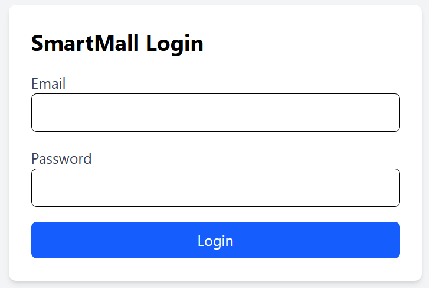
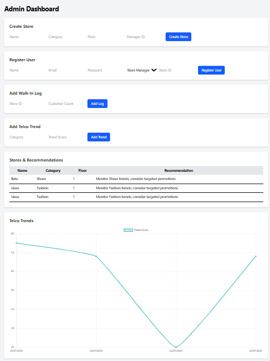
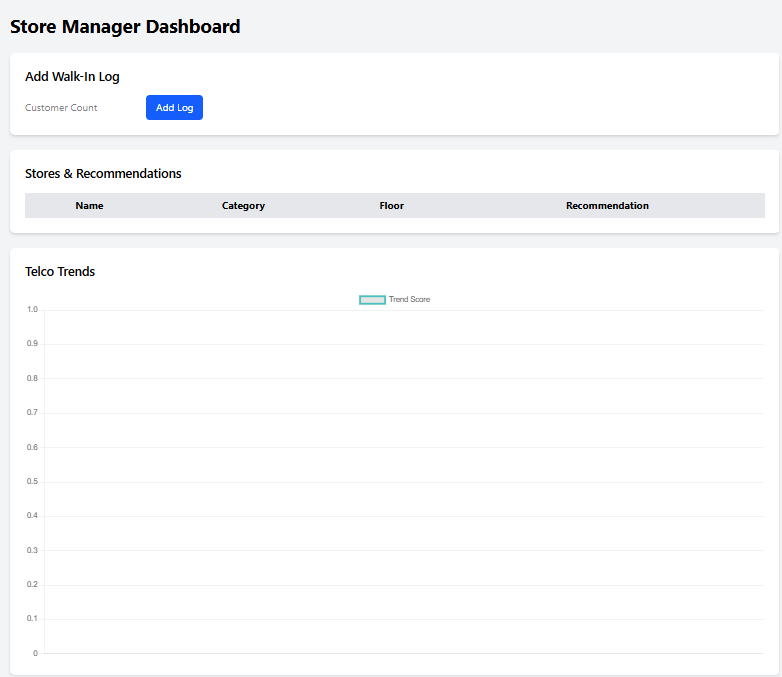

# SmartMall

SmartMall is a full-stack analytics and recommendation platform built for shopping mall managers. It includes a Node.js backend with MongoDB, JWT-based authentication, and a React + Tailwind frontend for admin and store manager workflows.

## Key Features

- Role-based authentication using JWT
- Admin and Store Manager dashboards
- Store management and registration
- Walk-in customer logging for stores
- Telco trend ingestion and visualization
- Store-level product recommendations based on traffic and trend data
- REST API documented with Swagger
- Frontend charts built with Chart.js

## Project Structure

- `backend/`
  - `server.js` - main Express server entrypoint
  - `config/` - database and Swagger setup
  - `controllers/` - API logic for auth, stores, trends, and logs
  - `middlewares/` - auth and error handling middleware
  - `models/` - Mongoose schemas for users, stores, trends, and walk-in logs
  - `routes/` - Express API routes
## Screenshot 

## Login Screen


## Admin Dashboard


## Store Manager Dashboard


## Getting Started

### Backend Setup

1. Navigate to the backend folder:
   ```bash
   cd backend
   ```
2. Install dependencies:
   ```bash
   npm install
   ```
3. Create a `.env` file with the following variables:
   ```env
   MONGO_URI=mongodb://localhost:27017
   DB_NAME=smartmall
   JWT_SECRET=your_jwt_secret_here
   ```
4. Start the backend server:
   ```bash
   npm start
   ```
5. Open Swagger API docs at:
   ```
   http://localhost:5000/api-docs
   ```

### Frontend Setup

1. Open a new terminal and navigate to the frontend folder:
   ```bash
   cd frontend
   ```
2. Install dependencies:
   ```bash
   npm install
   ```
3. Start the frontend dev server:
   ```bash
   npm run dev
   ```
4. Visit the app at the Vite URL shown in the terminal (usually `http://localhost:5173`).

## Environment Variables

Create a `.env` file in `backend/` with the following variables (example):

```env
MONGO_URI=mongodb://localhost:27017
DB_NAME=smartmall
JWT_SECRET=your_jwt_secret_here
PORT=5000
```

You may also set `ADMIN_TOKEN` in test environments as used by some backend tests.

## Running Tests

From the backend folder:

```bash
npm test
```

> The backend includes Jest + Supertest tests for auth, store management, and recommendation workflows.

## Usage

### Authentication

- Admin users can register store managers, create stores, add walk-in logs, and create telco trends.
- Store Managers can log walk-in traffic for their assigned store, view current store data, and see trend charts.

### API Endpoints

- `POST /api/auth/login` - user login
- `POST /api/auth/register` - admin-only user registration
- `GET /api/stores` - list stores
- `POST /api/stores` - create a store (admin only)
- `GET /api/stores/recommendations` - get store recommendations
- `GET /api/telcotrends` - get trend data
- `POST /api/telcotrends` - create trend data (admin only)
- `GET /api/walkinlogs` - list walk-in logs
- `POST /api/walkinlogs` - add a new walk-in log

For full request/response details visit the Swagger UI at `/api-docs` when the server is running.

## Notes

- The backend uses CORS with the frontend origin configured for `http://localhost:5173`.
- Store Manager registration requires a valid `store` id.
- Trend recommendations are computed from recent telco trend scores and customer traffic.

## Contributing

1. Fork the repo.
2. Create a feature branch.
3. Open a pull request with a clear description.

### Recommended Git Workflow

- Create feature branches from `main`: `git checkout -b feature/your-feature`
- Push branch and open a PR for review
- Keep `main` protected and merge via PR

## License

This project is released under the ISC License.

## Contact

If you need help setting up or want to contribute, open an issue or contact the maintainer via the repository's GitHub page.

